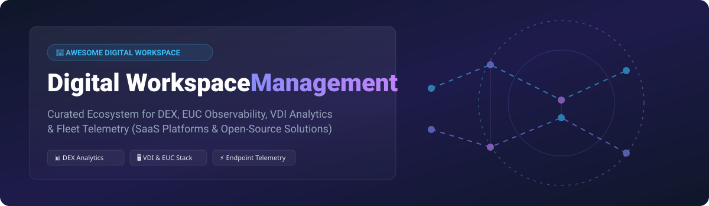

# 💻 Awesome Digital Workspace Management & Digital Employee Experience (DEX) Ecosystem 🚀

    

> 🌟 **A Curated List of Enterprise SaaS Platforms & Open-Source GitHub Projects for Digital Workspace Management, End-User Computing (EUC) Monitoring, Endpoint Performance Telemetry, VDI Analytics & Digital Employee Experience (DEX) Observability.**

---

## 📌 Table of Contents

- [🌐 Industry Overview & Market Intelligence](#-industry-overview--market-intelligence)
- [🏢 SaaS & Enterprise DEX Platforms](#-saas--enterprise-dex-platforms)
- [⚡ Open-Source GitHub Projects & Monitoring Tools](#-open-source-github-projects--monitoring-tools)
- [🏗️ Frameworks & Architecture Guidelines](#%EF%B8%8F-frameworks--architecture-guidelines)
- [🤝 How to Contribute](#-how-to-contribute)
- [💖 Support & Sponsorship](#-support--sponsorship)
- [📜 Disclaimer](#-disclaimer)
- [📈 Star History](#-star-history)

---

## 🌐 Industry Overview & Market Intelligence

> 📈 **Market Size & Growth**: The global **Digital Employee Experience (DEX) and Digital Workspace Management** market size was valued at **~$3.2 Billion in 2024** and is projected to reach **~$7.5 Billion by 2030**, growing at a CAGR of **~15.2%**.  
> 🧩 **Market Fragmentation & Competitive Dynamics**: The sector is **moderately fragmented**. While legacy enterprise UEM (Unified Endpoint Management) and VDI optimization vendors (like Omnissa/VMware and Citrix) retain strong installed bases, pure-play DEX platforms (like Nexthink and ControlUp) hold dominant market share in proactive observability and automated endpoint remediation. The market is transitioning toward **concentrated platform suites** powered by AI-driven telemetry (AIOps).

---

## 🏢 SaaS & Enterprise DEX Platforms

The table below curates the leading enterprise DEX and EUC monitoring SaaS platforms, sorted by **Company Size / Valuation / Revenue (Descending)** ⬇️.

| Rank | Platform 🖥️ | Company Size / Valuation / Revenue 💰 | Starting Tier Pricing 💵 | Free Tier / Free Trial Limits ⏳ | Key Focus & Capabilities 🎯 |
| :---: | :--- | :--- | :--- | :--- | :--- |
| **1** | **[Omnissa Workspace ONE](https://www.omnissa.com/)** | **~$12.0B** (Acquired by KKR for $12B from Broadcom/VMware) | **$3.78** / device / month (Standard tier) | **30-day Free Trial** (Up to 100 devices with full UEM & DEX suite access) | Unified Endpoint Management (UEM), Virtual Workspace analytics, automated compliance, and digital experience scoring. |
| **2** | **[Nexthink](https://www.nexthink.com/)** | **~$3.0B** (Valuation following $180M Series D) | **$6.00** / endpoint / month (Infinity Experience Platform base) | **14-day Free Trial** (Guided sandbox environment up to 50 endpoint nodes) | Market leader in real-time endpoint telemetry, user sentiment surveys, and self-healing automated remediation. |
| **3** | **[Riverbed Aternity](https://www.riverbed.com/products/aternity.html)** | **~$1.0B** (Estimated valuation under Thoma Bravo) | **$4.50** / agent / month (All-End-User Monitoring edition) | **14-day Free Trial** (Full SaaS feature set limited to 25 monitored enterprise endpoints) | Actual User Experience (EUEM), application transaction performance, device health correlation, and SaaS UX visibility. |
| **4** | **[ControlUp](https://www.controlup.com/)** | **~$750M** (Valuation following $100M Series E) | **$2.50** / monitored user / month (ControlUp Edge DX tier) | **21-day Free Trial** (50 concurrent endpoints / VDI sessions with real-time metrics) | Real-time VDI, DaaS (Citrix, AVD, Horizon), and physical endpoint experience monitoring with active script automation. |
| **5** | **[Lakeside SysTrack](https://www.lakesidesoftware.com/)** | **~$500M** (Estimated valuation under Insight Partners) | **$4.00** / endpoint / month (SysTrack Cloud Foundation) | **14-day Free Trial** (Up to 100 monitored desktop endpoints with predictive AI analytics) | Deep desktop telemetry collection, root-cause diagnostics, asset optimization, and proactive IT support guidance. |
| **6** | **[Nerdio Manager](https://getnerdio.com/)** | **~$250M** (Valuation following $117M Series B) | **$3.00** / active user / month (Enterprise edition) | **30-day Free Trial** (Unlimited Azure Virtual Desktop (AVD) & Windows 365 users) | Azure Virtual Desktop (AVD) and Windows 365 auto-scaling, cost optimization, and unified management platform. |
| **7** | **[Liquidware FlexApp & Stratusphere UX](https://www.liquidware.com/)** | **~$80M** (Estimated annual revenue) | **$1.50** / user / month (Stratusphere UX Base) | **15-day Free Trial** (Up to 25 user licenses with full diagnostic diagnostic features) | Workspace environment management, application layering (FlexApp), and diagnostics for VDI/physical fleets. |
| **8** | **[UberAgent](https://uberagent.com/)** | **~$30M** (Estimated valuation) | **$1.20** / endpoint / month (Standard license) | **30-day Free Trial** (Fully functional agent trial with no endpoint count limits) | Lightweight Splunk/Elastic endpoint & UX monitoring agent for Windows and macOS desktop performance. |
| **9** | **[Flexxible](https://www.flexxible.com/)** | **~$15M** (Estimated valuation) | **$2.00** / device / month (Flexxible Workspaces) | **14-day Free Trial** (Up to 20 endpoints / hybrid workspace environments) | Intelligent digital workspace management, automated IT operations, and hybrid workforce experience control. |

---

## ⚡ Open-Source GitHub Projects & Monitoring Tools

Community-curated open-source projects for endpoint telemetry, VDI monitoring, and workspace observability. Sorted by **GitHub Star Count (Descending)** ⬇️.

| Project Name 🛠️ | GitHub Stars ⭐ | Primary Workspace Category 🏷️ | Description & Use Case 📖 |
| :--- | :---: | :--- | :--- |
| **[Grafana](https://github.com/grafana/grafana)** |  | Workspace Observability & Dashboards | Premier open-source visualization dashboard widely used to combine VDI metrics, endpoint telemetry, and user session logs. |
| **[Prometheus](https://github.com/prometheus/prometheus)** |  | Telemetry & Metrics Collection | Systems monitoring and alerting toolkit serving as the backbone for custom endpoint & infrastructure observability pipelines. |
| **[osquery](https://github.com/osquery/osquery)** |  | Endpoint Instrumentation | SQL-powered operating system instrumentation framework for querying hardware, processes, performance, and fleet configuration. |
| **[Zabbix](https://github.com/zabbix/zabbix)** |  | Enterprise Fleet Monitoring | Enterprise-class open-source monitoring solution for network performance, user session tracking, and endpoint health. |
| **[Glances](https://github.com/nicolargo/glances)** |  | Real-Time Endpoint Telemetry | An open-source cross-platform system monitoring tool providing real-time system metrics via web interface or API. |
| **[Fleet](https://github.com/fleetdm/fleet)** |  | Open Device & Fleet Management | Open-source osquery manager providing device management, continuous vulnerability monitoring, and endpoint posture checks. |
| **[Netdata](https://github.com/netdata/netdata)** |  | Low-Latency Endpoint Performance | Real-time performance and health monitoring agent providing sub-second resolution for distributed client devices. |
| **[Checkmk](https://github.com/Checkmk/checkmk)** |  | IT Infrastructure & Session Tracking | High-performance IT monitoring platform adaptable for VDI hosts, session latency, and workstation health checking. |
| **[LibreNMS](https://github.com/librenms/librenms)** |  | Workspace Network Adjacency | Auto-discovering PHP/MySQL/SNMP network monitoring system tracking network latency impacting digital workspace performance. |
| **[Prometheus windows_exporter](https://github.com/prometheus-community/windows_exporter)** |  | Windows Endpoint Metrics | Prometheus exporter for Windows machines monitoring CPU, memory, disk I/O, Remote Desktop sessions, and OS performance counters. |
| **[EUCMonitoring](https://github.com/dbretty/EUCMonitoring)** |  | End User Computing (EUC) Suite | Community PowerShell-based platform tailored for monitoring Citrix Virtual Apps and Desktops, logon times, and EUC infrastructure health. |

---

## 🏗️ Frameworks & Architecture Guidelines

When assembling a custom open-source Digital Workspace Management stack:
- **Telemetry Collection**: Deploy `osquery` or `windows_exporter` on client devices.
- **Aggregation & Storage**: Ingest metrics into `Prometheus` or `Netdata`.
- **Visualization**: Build real-time dashboards using `Grafana` to track logon times, CPU/Memory bottlenecks, and app crashes.
- **Session Diagnostics**: Utilize `EUCMonitoring` scripts to monitor Citrix/AVD session performance and profile load times.

---

## 🤝 How to Contribute

Contributions are highly encouraged! To add a SaaS platform or Open-Source project:
1. Fork this repository. 🍴
2. Create a new branch (`git checkout -b add-workspace-tool`). 🌿
3. Update `README.md` maintaining table formatting, metrics, and star badges. 📝
4. Open a Pull Request with details about the project. 🚀

---

## 💖 Support & Sponsorship

Thank you so much for using and supporting this curated Awesome Digital Workspace Management list! 🙏

If you find this repository valuable, please consider:
- ⭐ **Starring** the project on GitHub to help others discover it.
- 🔀 **Forking** and sharing it with your IT, EUC, and DevOps teams.
- ☕ Buying us a coffee or supporting ongoing maintenance via the [GitHub Sponsor Dashboard](https://github.com/sponsors/ishandutta2007).

---

## 📜 Disclaimer

- This list is **community-curated** for educational and architectural purposes.
- Endpoint telemetry collects device and session usage data. Always ensure compliance with national/international privacy regulations (e.g., GDPR, CCPA) and employee privacy guidelines.
- Product logos and brand names belong to their respective corporate owners.

---

## 📈 Star History

---

<b>Made with ❤️ for EUC Architects, Desktop Support Leaders, System Engineers, and Workplace Digital Experience Pioneers.</b>

